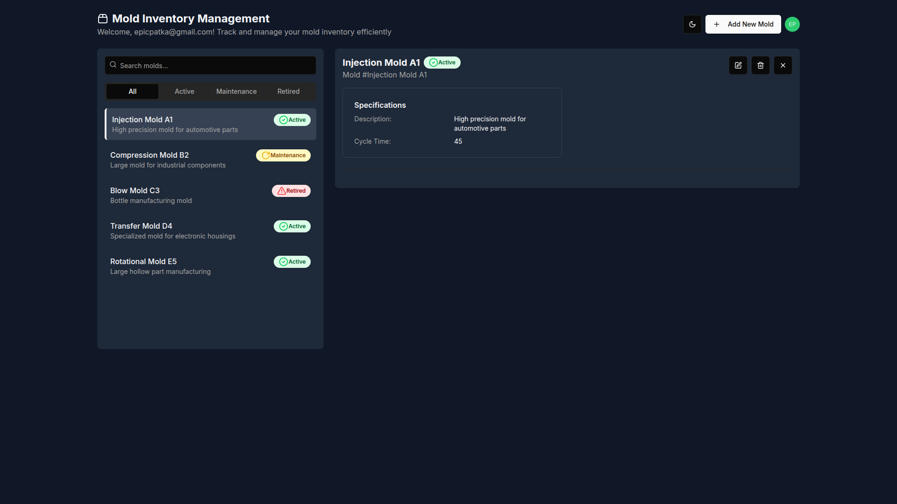

# Mold Inventory

[https://mold-inventory-app-production.epicpatka.workers.dev/](https://mold-inventory-app-production.epicpatka.workers.dev/)

## Architecture

This is a monorepo powered by [Nx](https://nx.dev/).

### Tech Stack
[Auth0](https://auth0.com/), [Cloudflare D1](https://developers.cloudflare.com/d1/), [Cloudflare Workers](https://developers.cloudflare.com/workers/), [Hono](https://hono.dev/), [Prisma](https://www.prisma.io/), [Next.js](https://nextjs.org/)


### Apps
- [`auth0-tenant`](./apps/auth0-tenant/README.md): [Auth0](https://auth0.com/) tenant configuration
- [`mold-inventory-api`](./apps/mold-inventory-api/README.md): Cloudflare Worker serving a [Hono](https://hono.dev/) API backend
- [`mold-inventory-app`](./apps/mold-inventory-app/README.md): Cloudflare Worker serving the [Next.js](https://nextjs.org/) app


### Implementation Details

#### auth0-tenant

[`auth0-tenant`](./apps/auth0-tenant/README.md): Deployable [Auth0](https://auth0.com/) tenant configuration for this app.

#### mold-inventory-api

[`mold-inventory-api`](./apps/mold-inventory-api/README.md): Cloudflare Worker [Hono](https://hono.dev/) API backend

- A Cloudflare Worker that serves a [Hono](https://hono.dev/) CRUD API to manage molds.
- Validates [Auth0](https://auth0.com/) JWT access token scope claim for permissions.
- Uses [Prisma](https://www.prisma.io/) ORM to manage a [Cloudflare D1](https://developers.cloudflare.com/d1/) database

#### mold-inventory-app

[`mold-inventory-app`](./apps/mold-inventory-app/README.md): Cloudflare Worker serving the [Next.js](https://nextjs.org/) app
  - [Auth0](https://auth0.com/) for login
  - [Next.js](https://developers.cloudflare.com/workers/framework-guides/web-apps/nextjs/) as the frontend React Framework


## UI




[See more UI screenshots](./apps/mold-inventory-app/docs/UI.md)

UI generated with [v0.dev](https://v0.dev/)


## Local Setup

### Install Dependencies

Install Node.js dependencies.
```bash
pnpm install
```

### Deploy Development Auth0 Configuration

Copy auth0 config from `apps/auth0-tenant/auth0-config.json.example` to `apps/auth0-tenant/auth0-config-dev.json` and fill out details using Machine to Machine client.

Deploy development Auth0 configuration.
```bash
pnpm nx deploy-dev auth0-tenant
```

#### Create Users

Create users in Auth0 dashboard.
- Assign permissions to users for the Mold Inventory API.
  - Available permissions: `create:molds`, `read:molds`, `update:molds`, and `delete:molds`

### Run the API locally

Setup local Cloudflare D1 database for the first time.
```bash
# setup local Cloudflare D1 database
pnpm nx db:migrate:local mold-inventory-api
pnpm nx db:seed:local mold-inventory-api

# generate prisma database schema
pnpm nx prisma:generate mold-inventory-api
```

Configure environment variables in `apps/mold-inventory-app/wrangler.jsonc`.

Run the API locally.
```bash
pnpm nx dev mold-inventory-api
```

### Run the App locally

Configure environment variables for development in `apps/mold-inventory-app/wrangler.jsonc`.

There are two ways to run the app locally, using either the Next.js development server, or the Cloudflare workerd runtime.

Run locally in Node.js using the Next.js development server, with hot-code reloading, error reporting, and more.
```bash
pnpm nx dev mold-inventory-app
```

Run locally in the Cloudflare workerd runtime, which is more accurate to production.
```bash
pnpm nx preview mold-inventory-app
```

Open [http://localhost:3000](http://localhost:3000) in your browser.


## Unit Testing

Run unit tests for API and App
```bash
pnpm nx run-many -t test -p mold-inventory-api mold-inventory-app
```

- `pnpm nx test mold-inventory-api` - vitest single run for API
- `pnpm nx test:watch mold-inventory-api` - vitest watch test suites for changes for API
- `pnpm nx test mold-inventory-app` - vitest single run for app
- `pnpm nx test:watch mold-inventory-app` - vitest watch test suites for changes for app


## Production Deploy

### Deploy Production Auth0 Configuration

Copy auth0 config from `apps/auth0-tenant/auth0-config.json.example` to `apps/auth0-tenant/auth0-config-prod.json` and fill out details using Machine to Machine client.

Deploy production Auth0 configuration.
```bash
pnpm nx deploy-prod auth0-tenant
```

Create users in Auth0 dashboard.
- Assign permissions to users for the Mold Inventory API.
  - Available permissions: `create:molds`, `read:molds`, `update:molds`, and `delete:molds`

### Deploy the API to Cloudflare
```bash
pnpm nx deploy mold-inventory-api
```

### Deploy the App to Cloudflare

Configure environment variables for production in `apps/mold-inventory-app/wrangler.jsonc`.

```bash
pnpm nx deploy mold-inventory-app
```

## Changesets

**Create a changeset:** Whenever a change is made that warrants a new release (e.g., bug fixes, new features), run:
```bash
pnpm changeset
pnpm changeset version
```

## Commands

### auth0-tenant
- `pnpm run deploy-dev` - deploy development Auth0 tenant
- `pnpm run deploy-prod` - deploy production Auth0 tenant

### mold-inventory-api
- `pnpm nx dev mold-inventory-api` - run Cloudflare Worker locally
- `pnpm nx lint mold-inventory-api` - check code with eslint
- `pnpm nx lint:fix mold-inventory-api` - fix code with eslint
- `pnpm nx format mold-inventory-api` - check code format with prettier
- `pnpm nx format:fix mold-inventory-api` - fix code format with prettier
- `pnpm nx test mold-inventory-api` - vitest single run
- `pnpm nx test:watch mold-inventory-api` -  vitest watch test suites for changes

#### Cloudflare Commands
- `pnpm nx db:create mold-inventory-api` - create mold-inventory-app database in Cloudflare
- `pnpm nx db:migrate mold-inventory-api` - setup mold-inventory-app database in Cloudflare
- `pnpm nx db:migrate:local mold-inventory-api` - setup mold-inventory-app database locally
- `pnpm nx db:seed mold-inventory-api` - seed initial mold-inventory-app data in Cloudflare
- `pnpm nx db:seed:local mold-inventory-api` - seed initial mold-inventory-app data locally
- `pnpm nx prisma:generate mold-inventory-api` - generate prisma database schema
- `pnpm nx cf-typegen mold-inventory-api` - update type definitions after adding new bindings to your Wrangler configuration
- `pnpm nx upload mold-inventory-api` - deploy preview version to Cloudflare
- `pnpm nx deploy mold-inventory-api` - deploy production version to Cloudflare

### mold-inventory-app
- `pnpm nx dev mold-inventory-app` - starts Next.js in development mode with hot-code reloading, error reporting, and more
- `pnpm nx build mold-inventory-app` - create optimized production build
- `pnpm nx start mold-inventory-app` - start Next.js in production mode
- `pnpm nx lint mold-inventory-app` - check code with eslint
- `pnpm nx lint:fix mold-inventory-app` - fix code with eslint
- `pnpm nx format mold-inventory-app` - check code format with prettier
- `pnpm nx format:fix mold-inventory-app` - fix code format with prettier
- `pnpm nx test mold-inventory-app` - vitest single run
- `pnpm nx test:watch mold-inventory-app` -  vitest watch test suites for changes

#### Cloudflare Commands
- `pnpm nx cf-typegen mold-inventory-app` - update type definitions after adding new bindings to your Wrangler configuration
- `pnpm nx cf:build mold-inventory-app` - build Next.js app for Cloudflare workerd runtime
- `pnpm nx preview mold-inventory-app` - run locally in the Cloudflare workerd runtime, which is more accurate to production
- `pnpm nx upload mold-inventory-app` - deploy preview version to Cloudflare
- `pnpm nx deploy mold-inventory-app` - deploy production version to Cloudflare
