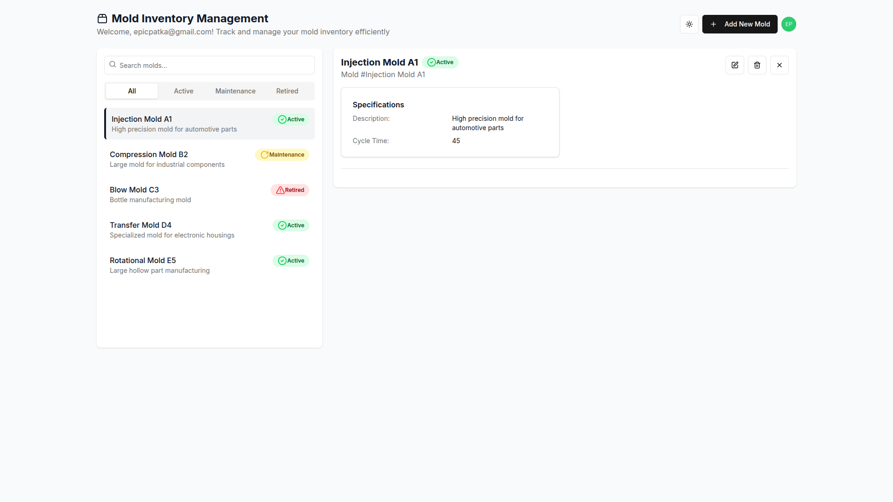

# Mold Inventory

Mold inventory management application

App: [https://mold-inventory-app-production.epicpatka.workers.dev/](https://mold-inventory-app-production.epicpatka.workers.dev/)

MCP Server: [https://molds-mcp-production.epicpatka.workers.dev/sse](https://molds-mcp-production.epicpatka.workers.dev/sse)

A mold inventory management system on Cloudflare Workers using Hono, Prisma ORM, Cloudflare D1, and Next.js, with authentication and authorization handled by Auth0. Includes a Model Context Protocol (MCP) server that allows an LLM to securely access and retrieve mold inventory data on behalf of users with appropriate permissions.

## Architecture

This is a monorepo powered by [Nx](https://nx.dev/).

### Tech Stack

[Auth0](https://auth0.com/), [Cloudflare D1](https://developers.cloudflare.com/d1/), [Cloudflare Workers](https://developers.cloudflare.com/workers/), [Hono](https://hono.dev/), [Prisma](https://www.prisma.io/), [Next.js](https://nextjs.org/)

### Apps

- [`auth0-tenant`](./apps/auth0-tenant/README.md): [Auth0](https://auth0.com/) tenant configuration
- [`mold-inventory-api`](./apps/mold-inventory-api/README.md): Cloudflare Worker serving a [Hono](https://hono.dev/) API backend
- [`mold-inventory-app`](./apps/mold-inventory-app/README.md): Cloudflare Worker serving the [Next.js](https://nextjs.org/) app
- [`molds-mcp`](./apps/molds-mcp/README.md): Cloudflare Worker Molds MCP server

### Implementation Details

#### auth0-tenant

[`auth0-tenant`](./apps/auth0-tenant/README.md): Deployable [Auth0](https://auth0.com/) tenant configuration for this app.

#### mold-inventory-api

[`mold-inventory-api`](./apps/mold-inventory-api/README.md): Cloudflare Worker [Hono](https://hono.dev/) API backend

- A Cloudflare Worker that serves a [Hono](https://hono.dev/) CRUD API to manage molds.
- Validates [Auth0](https://auth0.com/) JWT access token scope claim for permissions.
- Uses [Prisma](https://www.prisma.io/) ORM to manage a [Cloudflare D1](https://developers.cloudflare.com/d1/) database

#### mold-inventory-app

[`mold-inventory-app`](./apps/mold-inventory-app/README.md): Cloudflare Worker serving the [Next.js](https://nextjs.org/) app

- [Auth0](https://auth0.com/) for login
- [Next.js](https://developers.cloudflare.com/workers/framework-guides/web-apps/nextjs/) as the frontend React Framework

#### molds-mcp

[`molds-mcp`](./apps/molds-mcp/README.md): Cloudflare Worker Molds MCP server

- [Auth0](https://auth0.com/) for login
- Allows an LLM to receive the list of molds on behalf of the user.
- User must have `read:molds` permission for the Mold Inventory API.

## UI




[See more UI screenshots](./apps/mold-inventory-app/docs/UI.md)

UI generated with [v0.dev](https://v0.dev/)

### MCP Server AI Chat


[See more AI screenshots](./apps/molds-mcp/docs/mcp-server-ai-chat.md)

## Local Setup

### Install Dependencies

Install Node.js 22 dependencies.

```bash
pnpm install
```

### Deploy Development Auth0 Configuration

Copy auth0 config from `apps/auth0-tenant/auth0-config.json.example` to `apps/auth0-tenant/auth0-config-dev.json` and fill out details using Machine to Machine client.

Deploy development Auth0 configuration.

```bash
pnpm nx deploy-dev auth0-tenant
```

#### Create Users

Create users in Auth0 dashboard.

- Assign permissions to users for the Mold Inventory API.
  - Available permissions: `create:molds`, `read:molds`, `update:molds`, and `delete:molds`

#### Configure Actions

Define secrets for MoldInventoryPostUserRegistration action.

- `DOMAIN` - Auth0 domain
- `CLIENT_ID` - Molds M2M Client ID
- `CLIENT_SECRET` - Molds M2M Client Secret

### Run the API locally

Create mold-inventory-api database in Cloudflare.

```bash
pnpm nx db:create mold-inventory-api
```

Set up local Cloudflare D1 database for the first time.

```bash
# set up local Cloudflare D1 database
pnpm nx db:migrate:local mold-inventory-api
pnpm nx db:seed:local mold-inventory-api

# generate prisma database schema
pnpm nx prisma:generate mold-inventory-api
```

Configure environment variables in `apps/mold-inventory-app/wrangler.jsonc`.

Run the API locally.

```bash
pnpm nx dev mold-inventory-api
```

### Run the App locally

Configure environment variables for development in `apps/mold-inventory-app/wrangler.jsonc`.

There are two ways to run the app locally, using either the Next.js development server, or the Cloudflare workerd runtime.

Run locally in Node.js using the Next.js development server, with hot-code reloading, error reporting, and more.

```bash
pnpm nx dev mold-inventory-app
```

Run locally in the Cloudflare workerd runtime, which is more accurate to production.

```bash
pnpm nx preview mold-inventory-app
```

Open [http://localhost:3000](http://localhost:3000) in your browser.

## Unit Testing

Run unit tests for API and App

```bash
pnpm nx run-many -t test -p mold-inventory-api mold-inventory-app
```

Run unit tests for API, App, and Auth0 Actions

```bash
pnpm nx run-many -t test --all
```

- `pnpm nx test auth0-tenant` - vitest actions single run for Auth0 actions
- `pnpm nx test:watch auth0-tenant` - vitest actions watch test suites for changes for Auth0 actions
- `pnpm nx test mold-inventory-api` - vitest single run for API
- `pnpm nx test:watch mold-inventory-api` - vitest watch test suites for changes for API
- `pnpm nx test mold-inventory-app` - vitest single run for app
- `pnpm nx test:watch mold-inventory-app` - vitest watch test suites for changes for app

## Staging Environment

Reference [Staging Deploy](./docs/staging.md).

## Production Deploy

Reference [Production Deploy](./docs/production.md).

## Changesets

**Create a changeset:** Whenever a change is made that warrants a new release (e.g., bug fixes, new features), run:

```bash
pnpm changeset
pnpm changeset version
```

## Commands

Reference available npm scripts in [commands](./docs/commands.md).
