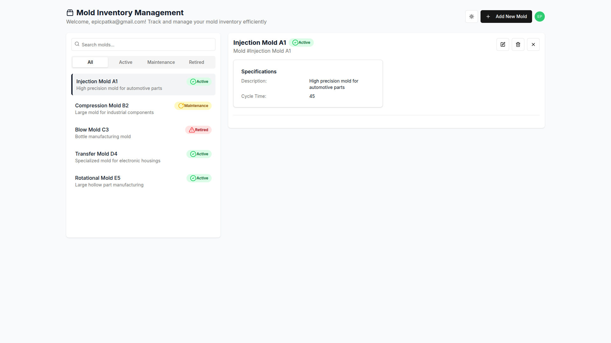
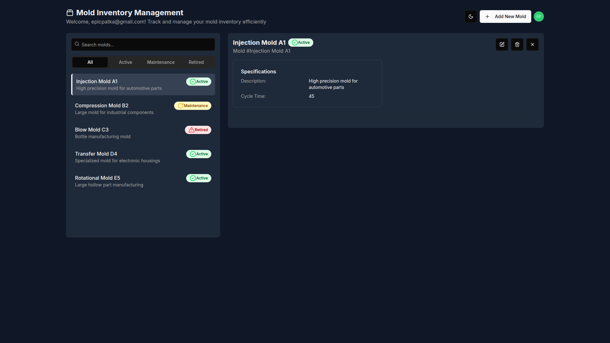

# Mold Inventory App

[https://mold-inventory-app-production.epicpatka.workers.dev/](https://mold-inventory-app-production.epicpatka.workers.dev/)

## Tech Stack

- [Auth0](https://auth0.com/)
- [Cloudflare Workers](https://developers.cloudflare.com/workers/)
- [Next.js](https://nextjs.org/)

### Implementation Details

A Cloudflare Worker that serves the [Next.js](https://nextjs.org/) app.

## UI





[See more UI screenshots](./docs/UI.md)

UI generated with [v0.dev](https://v0.dev/)

## Setup

Install Node.js dependencies.

```bash
# install Node.js dependencies
pnpm install
```

### App

Configure environment variables for development in `wrangler.jsonc`.

There are two ways to run the app locally, using either the Next.js development server, or the Cloudflare workerd runtime.

Run locally in Node.js using the Next.js development server, with hot-code reloading, error reporting, and more.

```bash
pnpm run dev
```

Run locally in the Cloudflare workerd runtime, which is more accurate to production.

```bash
pnpm run preview
```

Open [http://localhost:3000](http://localhost:3000) in your browser.

## Unit Testing

- `pnpm run test` - vitest single run
- `pnpm run test:watch` - vitest watch test suites for changes

## Deploy to Cloudflare

Configure environment variables for production in `wrangler.jsonc`.

```bash
pnpm run deploy
```

## Commands

- `pnpm run dev` - starts Next.js in development mode with hot-code reloading, error reporting, and more
- `pnpm run build` - create optimized production build
- `pnpm run start` - start Next.js in production mode
- `pnpm run type-check` - typescript type check
- `pnpm run lint` - check code with eslint
- `pnpm run lint:fix` - fix code with eslint
- `pnpm run test` - vitest single run
- `pnpm run test:watch` - vitest watch test suites for changes

### Cloudflare Commands

- `pnpm run cf-typegen` - update type definitions after adding new bindings to your Wrangler configuration
- `pnpm run cf:build` - build Next.js app for Cloudflare workerd runtime
- `pnpm run preview` - run locally in the Cloudflare workerd runtime, which is more accurate to production
- `pnpm run preview:staging` - run locally in the Cloudflare workerd runtime, which is more accurate to production, with Auth0 staging tenant
- `pnpm run upload` - deploy preview version to Cloudflare
- `pnpm run deploy` - deploy production version to Cloudflare
