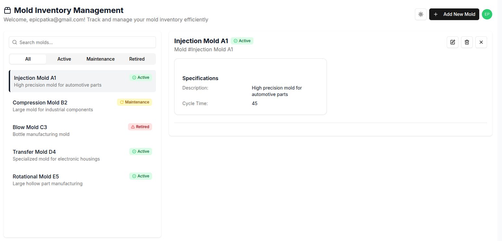

# Mold Inventory App

[https://mold-inventory-app-production.epicpatka.workers.dev/](https://mold-inventory-app-production.epicpatka.workers.dev/)

## Tech Stack
- [Auth0](https://auth0.com/)
- [Cloudflare Workers](https://developers.cloudflare.com/workers/)
- [Next.js](https://nextjs.org/)

### Implementation Details

A Cloudflare Worker that serves the [Next.js](https://nextjs.org/) app.

## UI



UI generated with [v0.dev](https://v0.dev/)


## Setup

Install Node.js dependencies.
```bash
# install Node.js dependencies
npm install
```

### App

Fill out Auth0 details for dev and prod in:
- `apps/mold-inventory-app/.env.development`
- `apps/mold-inventory-app/.env.production`

Configure environment variables in `wrangler.jsonc`.

Run the app locally.
```bash
npm run dev
```

Open [http://localhost:3000](http://localhost:3000) in your browser.

## Unit Testing
- `npm run test` - vitest single run
- `npm run test:watch` - vitest watch test suites for changes

## Deploy to Cloudflare
```bash
npm run deploy
```

## Commands

### Cloudflare Commands
- `npm run cf-typegen` - update type definitions after adding new bindings to your Wrangler configuration
- `npm run upload` - deploy preview version to Cloudflare
- `npm run deploy` - deploy production version to Cloudflare
